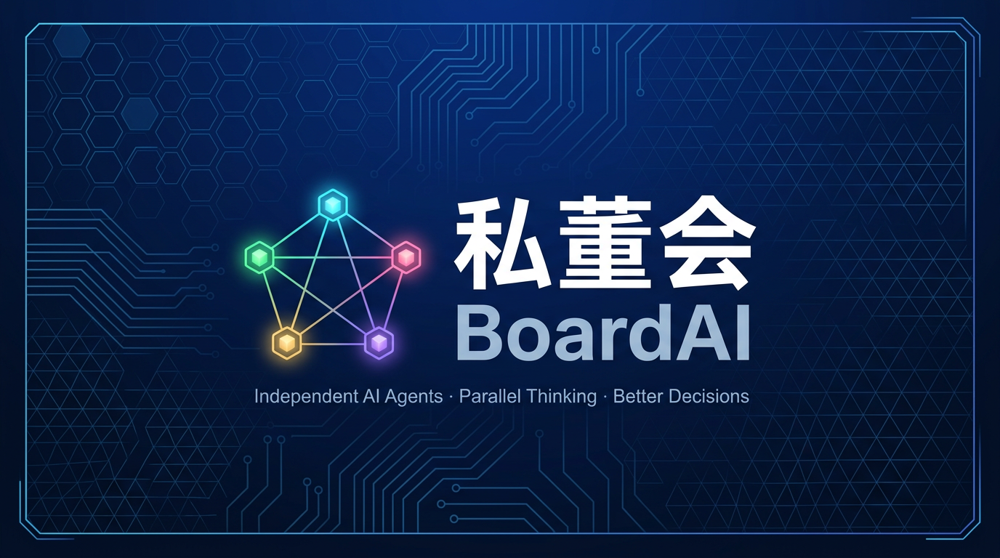

<p align="center">
  
</p>

<h1 align="center">私董会 BoardAI</h1>

<p align="center">
  <strong>你的 AI 私人董事会 — 5 个专家帮你做一个好决策</strong>
</p>

<p align="center">
  
  
  
  
  
</p>

<p align="center">
  <a href="#快速上手">快速上手</a> •
  <a href="#工作原理">工作原理</a> •
  <a href="#平台兼容">平台兼容</a> •
  <a href="#安装">安装</a> •
  <a href="#进化机制">进化机制</a> •
  <a href="#文件结构">文件结构</a> •
  <a href="#学术基础">学术基础</a>
</p>

---

## 一句话说明

把一个**拿不定主意的决策**交给 5 个不同思维方式的 AI 专家 → 独立发言 → 互相质疑 → 红队攻击 → 主持人裁决 → 输出一份**有置信度、有分歧标注、有止损线**的可执行结论。

> "好的决策不是没有分歧，而是所有分歧都被看见了。"

---

## 为什么不直接问 AI 同一个问题让它多想几遍？

因为**同一个 AI 想 10 遍，本质上还是同一个脑子**。它会：
- 重复同样的偏见（训练数据里什么多就偏什么）
- 自我强化第一次的答案（锚定效应）
- 永远不会真正反驳自己（sycophancy 谄媚本能）

**私董会的做法完全不同**：

```
❌ 普通方式：1 个 AI × 想 5 遍 = 5 个相似答案

✅ 私董会：5 个独立 AI Agent × 各自 1 遍 = 5 个真正不同的视角
         ↓
    互相质疑 + 红队攻击 → 分歧被看见 → 加权裁决
```

**技术实现**：每个角色是一个**独立的 subagent**（独立上下文窗口），物理隔离——它们真的看不到彼此的回答，不是"假装看不到"。

> 💡 在不支持 subagent 的平台（ChatGPT/DeepSeek 等）上，Skill 自动退化为顺序模拟模式（强 prompt 约束隔离），效果约为真并发的 70%。详见下方[平台兼容](#平台兼容)。

这就像真正请了 5 个不同背景的顾问，而不是让同一个顾问换 5 个马甲。

---

## 解决什么问题

你做重大决策时面临的真实困境：

| 困境 | 本 Skill 的解法 |
|------|----------------|
| 自己想来想去只有一个视角 | 5 个异构思维角色强制展开不同面 |
| ChatGPT 给建议太"正确"太圆滑 | 强制反对者 + 赞同必带风险 + 红队攻击 |
| AI 容易编数据 | 引证三态标注 + 缺数据直接暂停 + 实时取证 |
| 讨论了半天但结论模糊 | 置信度加权裁决 + 共识矩阵 + 三条路径 |
| 决策后不知道什么时候该变 | 明确列出"重新讨论触发条件" |

---

## 快速上手

对话中直接说：

```
帮我评估一下：该不该从大厂跳到一家 A 轮创业公司？
```

Skill 自动完成全流程，输出结构化裁决卡。

### 更多触发方式

- "帮我评估 xxx" / "开个董事会讨论"
- "这几个方案哪个好" / "找出盲点"
- "要不要跳槽/买房/创业" / "技术选型 A vs B"
- "PRD 审查" / "立项决策" / "道德两难"

---

## 工作原理

```
┌─────────────────────────────────────────────────────────────┐
│  第 0 步：议题确认 + 实时取证（可选）                          │
└─────────────────────┬───────────────────────────────────────┘
                      ▼
┌─────────────────────────────────────────────────────────────┐
│  第 1 步：5 角色独立发言（互不知晓）                           │
│  ┌────┐ ┌────┐ ┌────┐ ┌────┐ ┌────┐                        │
│  │数据│ │用户│ │怀疑│ │执行│ │战略│  ← 每人 ≤300 字 + 置信度  │
│  └────┘ └────┘ └────┘ └────┘ └────┘                        │
└─────────────────────┬───────────────────────────────────────┘
                      ▼
┌─────────────────────────────────────────────────────────────┐
│  第 2 步：交叉质询（找共识 + 暴露分歧 + 互相反驳）             │
└─────────────────────┬───────────────────────────────────────┘
                      ▼
┌─────────────────────────────────────────────────────────────┐
│  第 3 步：红队压测（攻击共识 + 未声明假设 + 替代方案）          │
└─────────────────────┬───────────────────────────────────────┘
                      ▼
┌─────────────────────────────────────────────────────────────┐
│  第 4 步：主持人裁决（加权结论 + 共识矩阵 + 三条路径）          │
└─────────────────────────────────────────────────────────────┘
```

---

## 安装

### QoderWork 用户

下载本仓库，在 QoderWork 中导入即可：

```bash
git clone https://github.com/songjian2018/board-ai.git ~/.qoderwork/skills/board-ai
```

### 其他 AI 平台（Claude / GPT / Gemini）

把 `SKILL.md` 内容粘贴到 System Prompt / Custom Instructions 中即可获得基础功能。

---

## 平台兼容

本 Skill 支持双模式执行，根据平台能力自动选择：

### 推荐平台（真并发模式 · 100% 效果）

| 平台 | 隔离方式 | 并发数 |
|------|---------|-------|
| **QoderWork** | Task 工具独立 subagent | 最多 10 |
| **Claude Code** | Task 工具（同架构） | 最多 10 |
| **Cursor 3.0+** | Agents Window 并发 | 最多 8 |

这些平台的 R1（第一轮独立发言）使用**物理隔离的独立 context**——5 个角色真的互相看不到。锚定效应为零，Identity Bias 大幅降低。

### 兼容平台（顺序模拟模式 · ~70% 效果）

| 平台 | 使用方式 | 注意事项 |
|------|---------|---------|
| **ChatGPT（Plus/Team）** | SKILL.md 贴入 Custom Instructions | 长度可能需裁剪 |
| **DeepSeek** | 贴入 System Prompt | 效果不错，中文能力强 |
| **Kimi / 通义 / 豆包** | 贴入 System Prompt | 视 context window 大小 |
| **OpenAI Agents SDK** | 可自行实现真并发 | 需写 Python 代码 |
| **CrewAI / LangGraph** | 可自行实现真并发 | 需编排代码 |

顺序模拟模式通过强 prompt 约束模拟隔离（每角色前插入隔离指令），已知局限：

- LLM attention 机制无法完全"忘记"已生成内容
- 后面的角色可能被前面的角色锚定
- 裁决卡会诚实标注"sequential 模式"

> **对开发者**：如果你使用 OpenAI Agents SDK / CrewAI / LangGraph，可以参考 SKILL.md 中的模式选择逻辑自行实现真并发。核心思路：R1 用 `asyncio.gather` 或 fan-out 并发 5 个独立 agent 调用，R2/R3 回到单 context 顺序执行。

### 可选增强：实时取证

安装 [research-pipeline](https://github.com/songjian2018/research-pipeline) 后，辩论引擎会自动拉取实时数据作为论据来源：

```bash
git clone https://github.com/songjian2018/research-pipeline.git ~/.qoderwork/skills/research-pipeline
```

配置搜索 API（可选，不配也能用）：

```bash
cat > ~/.qoderwork/secrets.env << 'EOF'
# Tavily — 免费 1000 次/月，注册：https://tavily.com
export TAVILY_API_KEY=your-key-here
EOF
chmod 600 ~/.qoderwork/secrets.env
```

> **不配 API key 也能正常使用**，退化为 WebSearch + Jina Reader（免费无限制）。

---

## 角色库

10 个预置角色，每场辩论自动选 5 个：

| 角色 | 思维方式 | 一句话 |
|------|---------|--------|
| 🔢 数据派 | 数据驱动 | 只看证据和数字 |
| 👤 用户派 | 用户共情 | 站在受影响者角度 |
| 🔍 怀疑派 | 反向质疑 | 专找漏洞和反例 |
| ⚡ 执行派 | 实操落地 | 只关心能不能做到 |
| 🎯 战略派 | 长期博弈 | 看 3-5 年壁垒 |
| 💰 投资人 | 风险收益 | 算 ROI 和机会成本 |
| 🧬 第一性原理 | 还原论 | 剥到最底层机制 |
| 🎲 概率派 | 贝叶斯更新 | 新证据进来就更新 |
| 🛡️ 最强反方 | 辩护少数派 | 为反面构建最强论证 |
| 💀 红队 | 攻击共识 | 找致命假设和失败场景 |

自定义角色：编辑 `assets/role-pool/` 下的 md 文件，格式参考现有角色。

---

## 核心规则（8 条）

1. **独立发言** — 第一轮角色互不知晓，防止附和
2. **异构思维** — 每人分析角度必须不同
3. **强制反对** — 每轮必有反对者
4. **赞同带刺** — 想同意先找 1 个风险
5. **置信度加权** — 不投票，按证据权重裁决
6. **300 字上限** — 简洁有力
7. **不编数据** — 没来源就说没有
8. **缺信息暂停** — 数据不够就 abstain

---

## 进化机制

本 Skill 内置半自动进化协议 — **自动收集，人工拍板**：

```
使用 Skill
    ↓ 自动
记录运行数据（evolution/runs/）
    ↓ 你反馈"这次不太对"
产出改进候选（evolution/candidates/PR-*.md）
    ↓ 你审核
采纳 → 跑回归测试 → 通过才生效
                    → 失败自动回滚
```

**为什么不全自动**：LLM 改自己的 prompt 容易越改越花哨（reward hacking），且无 ground truth 评估好坏。所以只自动产出候选，由你决定是否采纳。

**关闭**：`--no-evolution` 或删除 `evolution/` 目录。

---

## 文件结构

```
board-ai/
├── SKILL.md                    # 主配置（v0.6.1）
├── README.md                   # 本文件
├── PITFALLS.md                 # 22 个已知失败模式
├── .gitignore
│
├── assets/
│   ├── banner.png              # GitHub 页面 banner
│   ├── role-pool/              # 10 个角色卡
│   ├── avatars/                # 角色头像 PNG
│   ├── mechanisms/             # 9 个内部机制文件
│   ├── scenarios/              # 11 类场景预设
│   ├── templates/verdict.md    # 裁决卡输出模板
│   └── tools/inline-assets.py  # 图片内联工具
│
├── evolution/                  # 自我进化（可选）
│   ├── EVOLUTION.md            # 协议
│   ├── changelog.md            # 变更记录
│   ├── stable-tag.txt          # 稳定版指针
│   ├── runs/                   # 运行归档（自动产生）
│   ├── feedback/               # 反馈记录（自动产生）
│   └── candidates/             # 改进候选（自动产生）
│
├── examples/                   # 使用样例
├── references/                 # 学术论文引用
└── tests/                      # 验证用例
```

---

## 11 类场景预设

开箱支持多种决策类型，自动匹配：

| 场景 | 典型问题 |
|------|---------|
| 职业决策 | 跳槽/转行/接 offer |
| 财务决策 | 投资/买房/大额支出 |
| 技术选型 | 框架/架构/工具选择 |
| PRD 审查 | 产品方案找盲点 |
| 项目立项 | Go/No-Go 决策 |
| 方案对比 | A vs B vs C |
| 期权评估 | 期权/股权/激励方案 |
| 人际关系 | 团队冲突/沟通策略 |
| 健康生活 | 生活方式重大调整 |
| 伦理两难 | 道德困境/价值冲突 |
| 通用决策 | 以上都不是时的兜底 |

---

## 与同类对比

| 维度 | Crucible | MAGI | 团子 | **本 Skill** |
|------|----------|------|------|-------------|
| 开源 | 部分 | ✅ | ❌ | ✅ |
| 角色可定制 | 部分 | ❌ | ❌ | ✅ 10 角色池 |
| 场景预设 | ❌ | 仅 PRD | ❌ | ✅ 11 类 |
| 反幻觉机制 | ❌ | 部分 | ❌ | ✅ 引证三态 |
| 实时取证 | ❌ | ❌ | ❌ | ✅ |
| 进化机制 | ❌ | ❌ | ❌ | ✅ |
| 中文优先 | ❌ | ✅ | ✅ | ✅ |

---

## 学术基础

设计借鉴 6 篇核心研究（详见 `references/research-foundation.md`）：

- **Sycophancy 谄媚** — 解法：独立发言 + 赞同必带反对点
- **Identity Bias** — 解法：R1 物理隔离（Task 并发）
- **Premature Convergence** — 解法：持续红队 + 魔鬼代言人
- **Mental Set Fixation** — 解法：异构 reasoning style
- **Hallucination Amplification** — 解法：引证三态 + 交叉验证
- **Cost of Consensus** — 解法：置信度加权 ≠ 投票

---

## FAQ

<details>
<summary><b>不是 QoderWork 用户能用吗？</b></summary>

可以。两种方式：

1. **快速方式**：把 `SKILL.md` 粘贴到任何 LLM 的 System Prompt（ChatGPT / DeepSeek / Kimi 等），Skill 自动以顺序模拟模式运行，效果约为真并发的 70%。
2. **开发者方式**：用 OpenAI Agents SDK / CrewAI / LangGraph 自行实现真并发（参考 SKILL.md 中的模式选择逻辑）。

角色库/场景预设等高级功能需要手动导入对应文件内容到 prompt 中。
</details>

<details>
<summary><b>ChatGPT 和 QoderWork 跑出来效果有区别吗？</b></summary>

有，核心区别在 R1（第一轮独立发言）：

- **QoderWork/Claude Code**：5 个角色在**物理隔离的 context** 中并发思考，完全看不到彼此 → 零锚定
- **ChatGPT**：5 个角色在**同一个 context** 中顺序生成，靠 prompt 约束模拟隔离 → 有一定锚定

实测差异：顺序模式下第 4-5 个角色约 30% 概率受前面角色影响，但比不用 Skill 直接问 ChatGPT 仍强很多。裁决卡会诚实标注使用的模式。
</details>

<details>
<summary><b>research-pipeline 必须装吗？</b></summary>

不必须。不装时 Skill 正常运行，只是取证退化为基础 WebSearch。装了之后辩论引擎会自动拉取实时数据做交叉验证，引证质量大幅提升。
</details>

<details>
<summary><b>API key 不配行不行？</b></summary>

完全可以。不配 key 时用 WebSearch + Jina Reader（免费无限制），只是搜索精度略降。
</details>

<details>
<summary><b>想加自己的角色怎么办？</b></summary>

在 `assets/role-pool/` 下新建 md 文件，格式参考现有角色。也可以用 `nuwa-skill` 自动蒸馏。
</details>

<details>
<summary><b>evolution 目录会越来越大吗？</b></summary>

每次运行约 2KB JSON，月活跃用户一年约 500KB。可以 `.gitignore` 或定期清理。
</details>

---

## 贡献

欢迎 PR：

- 🎭 新角色卡 → `assets/role-pool/`
- 🎯 新场景预设 → `assets/scenarios/`
- 📖 术语词典扩展 → `assets/mechanisms/glossary.md`
- 🐛 新发现的 PITFALL → `PITFALLS.md`
- 💡 改进候选 → `evolution/candidates/`

---

## Star History

如果这个 Skill 帮到了你，给个 ⭐ 让更多人看到。

---

<p align="center">
  
</p>

<p align="center">
  <sub>Built with ❤️ by <a href="https://github.com/songjian2018">songjian2018</a> — Powered by QoderWork</sub>
</p>
